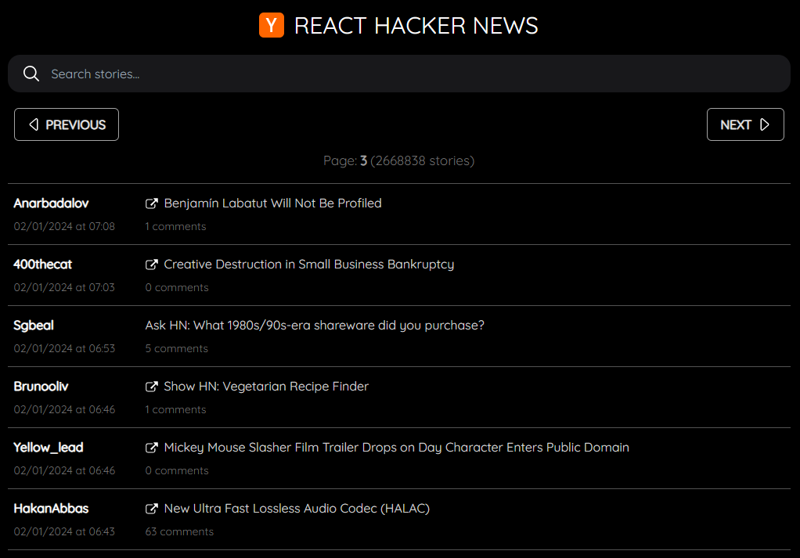

# React Hacker News

_Demo project made by Pedro Iván Gazulla Giménez_  
 
This React (Vite) app is a Hacker News story viewer, it uses Hacker News API to fetch stories and show them to the user.  
 

## To run the app (dev mode)

1. Make sure you have [Node.js](https://nodejs.org) installed.
2. Download the source code from this repository.
3. Extract the source code to a directory.
4. Open a terminal and enter to the project directory: "cd" command.
5. Run: `npm install`
6. Run: `npm run dev`
7. Open [http://localhost:5173](http://localhost:5173) to view the app in the browser.
